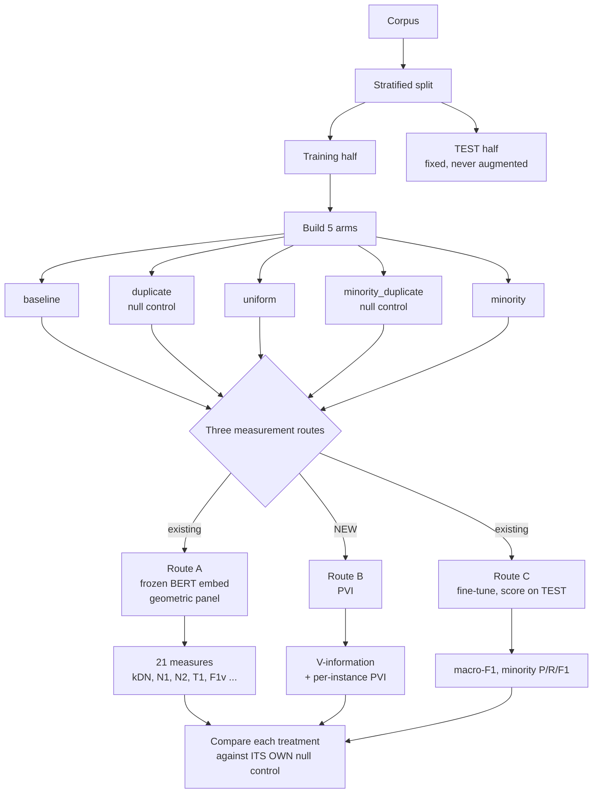
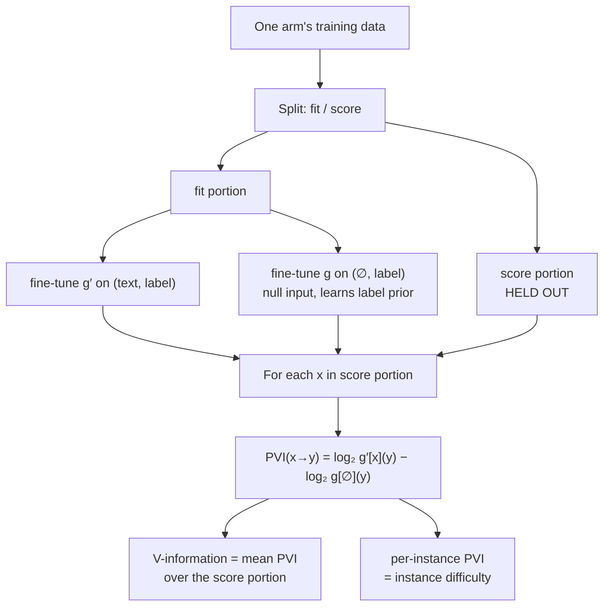
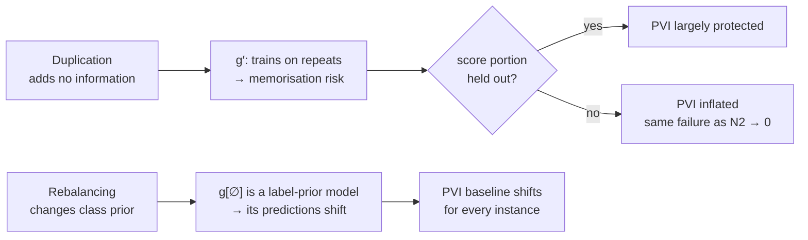

# Adding PVI as a third measurement route

How pointwise V-usable information would slot into the existing five-arm
design, what it measures that the geometric panel does not, and where each
artifact can still enter.

Method: Ethayarajh et al., *Understanding Dataset Difficulty with V-Usable
Information*.

---

## 1. Where it fits

The arms and the fixed test set are unchanged. PVI is a **third route** running
alongside the two that already exist.

## 2. How PVI is computed, per arm

The part that is easy to get wrong is the second model: `g` sees **no input at
all**, only labels. It learns the label prior, and PVI is the improvement the
real input buys over that prior.

**The score portion must be held out.** Estimated on data the model trained on,
duplication drives memorisation and inflates PVI directly. Held-out estimation
is what makes PVI potentially robust to the density artifact — it is a property
of the protocol, not of the measure.

## 3. Why this design makes an unusually clean comparison

The null controls were built to match their treatments on sample count, class
balance, source samples, and seed. That has a consequence specific to PVI:

| Pair | Label distributions | Therefore |
| --- | --- | --- |
| `uniform` vs `duplicate` | **identical** (original labels, doubled) | same `g[∅]` |
| `minority` vs `minority_duplicate` | **identical** (rebalanced to 1:1) | same `g[∅]` |

Within a pair the null-input model is the same, so **any PVI difference comes
entirely from `g′` — that is, entirely from the text.** The prior term cancels.
That is a cleaner contrast than the geometric panel can offer, where every
measure mixes text and composition effects together.

Across pairs it does *not* cancel, and that is where the composition artifact
lives.

## 4. Where each artifact can still enter

**Prediction, stated before running:** PVI survives `duplicate` and fails
`minority_duplicate`. The density artifact has no route in once scoring is
held out; the composition artifact has a direct route through `g[∅]`.

This is a prediction, not a citation — it does not appear to have been tested,
which is what makes it worth running.

## 5. What each outcome would mean

| Outcome | Interpretation |
| --- | --- |
| PVI beats controls where kDN does not | Information-theoretic measures are more robust; concrete recommendation for text |
| PVI fails the same controls | The null-control requirement is **general to dataset-difficulty measurement**, not a quirk of geometry — the strongest result |
| PVI survives `duplicate`, fails `minority_duplicate` | Each family is vulnerable to a *specific* artifact; yields a map of which measure to trust under which intervention |

All three are publishable, which is a good sign the question is well posed.

## 6. Cost

Two fine-tuning runs per arm per seed, against one for the accuracy route.

- 5 arms × 2 models × 5 seeds = **50 runs**, roughly double the last full
  experiment.
- The `g[∅]` models are cheap: empty inputs, fast convergence.
- **They can be shared.** Only two distinct label distributions exist across the
  five arms (original-doubled and rebalanced-1:1), so `g[∅]` need only be
  trained twice per seed rather than five times. That cuts the null-model work
  by 60%.

## 7. Sequence

1. Implement PVI estimation with a held-out score split — the protocol
   requirement in §2 is the thing to get right.
2. Run it across the five existing arms. This is the head-to-head against §3.1
   of [FINDINGS.md](FINDINGS.md), on identical data.
3. Run both measure families across the four PhraseBank agreement thresholds —
   the genuine-difficulty axis (objective O4 in [RESEARCH.md](RESEARCH.md)).
4. Only then consider PVI-filtered augmentation, which is the published fix for
   the null result this project produced.
